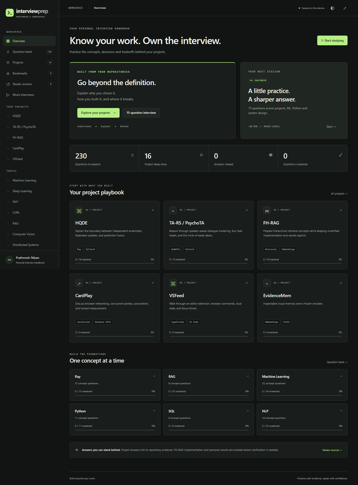

# InterviewPrep

A personal interview handbook for Prathmesh Nikam, built around repository evidence rather than invented project stories.

**Website:** [prathmesh333.github.io/InterviewPrep](https://prathmesh333.github.io/InterviewPrep/)



## What you can practice

- 230 questions across 16 project sections and 16 fundamental topics.
- HQDE, FH-RAG, TA-RS / PsychoTA, Ray, CanIPlay, VSFeed, EvidenceMem, ForecastForge, TreeStack CNN, ResearchHub, Neural Consensus Engine, JanSeva AI, F1 prediction, Shortlist’d, Iris, TakeOne and TRACE. Ray concepts connect to HQDE rather than treating the upstream Ray fork as original work.
- Collapsed quick, interview and deep answers; likely follow-ups, common mistakes, related questions, source links and diagrams.
- Search across questions, answers, tags, projects and technologies. Combine project, topic, difficulty and question-type filters.
- Focused study, balanced random 15-question interviews and project-defense sequences with follow-up prompts.
- Bookmarks, viewed answers, self-rated mastery, revision flags and personal notes in localStorage. Export/import a progress backup from Sources & coverage.
- Runnable Python examples and eight SQL exercises with fixtures and expected results. Code is displayed and copyable; the website does not execute arbitrary code.
- Responsive dark/light UI, keyboard navigation, reduced-motion support and `/` to search.

## Evidence rules

Project links pin inspected source revisions. Code supports implementation behavior; it does not establish sole authorship, personal debugging stories, benchmark outcomes or production deployment. Those claims use **Needs clarification from Prathmesh** where applicable.

FH-RAG appears in the public portfolio with `repo: null`. Its section explains the supplied concepts and explicitly leaves formulas, code, datasets and numerical results unverified. TA-RS is linked to PsychoTA by the portfolio. The handbook corrects several gaps between README descriptions and actual execution, including HQDE's effective learning-rate setup and PsychoTA's parallel attention/GRU branches. See [repository audit](docs/REPOSITORY_AUDIT.md) and [coverage map](docs/COVERAGE.md).

First-person project walkthroughs are practice scaffolds. Confirm your own contribution in notes before saying “I implemented.” Mastery is a self-rating, not an automated assessment. The UI uses compact answers rather than artificially padding every explanation to a fixed speaking duration.

## Run locally

Requires Node.js 22 or newer for the development tools. The deployed application has no runtime package dependencies or backend.

```sh
npm ci
npm run dev
```

Open [the local preview](http://127.0.0.1:4173/InterviewPrep/). Use an HTTP server; opening `index.html` directly with `file://` cannot load the JSON modules reliably.

```sh
npm test
npx playwright install chromium
npm run test:browser
python scripts/check_examples.py
npm run build
```

`dist/` is the deployable site. Python is only needed for the optional standard-library SQL/Python example checks. Ray and PyTorch examples require their named packages and are syntax-checked, not trained as part of website validation.

## Directory structure

```text
index.html                    semantic shell and metadata
styles.css                    responsive theme and layouts
app.js                        rendering, navigation and interactions
core.js                       filtering, session selection and progress rules
data/projects.json            project metadata and source links
data/projects/*.json           project-specific question banks
data/fundamentals.json         topic and SQL question banks
data/manifest.json             list of question files loaded by the app
scripts/                      preview, static build and example validation
tests/                        logic, data and browser interaction tests
docs/                         audit, coverage and screenshots
.github/workflows/pages.yml   validation and GitHub Pages deployment
PROJECT_SPEC.md               original supplied specification
```

## Add or edit a question

Edit the appropriate JSON bank directly. Keep IDs stable so saved progress continues to refer to the same question. A question needs:

```json
{
  "id": "project-stable-id",
  "project": "hqde",
  "topic": "Distributed Systems",
  "question": "What is the exact question?",
  "quick": "A concise standalone answer.",
  "standard": "A spoken explanation of the mechanism and tradeoff.",
  "deep": "Implementation details, assumptions and limitations.",
  "difficulty": "Intermediate",
  "type": "Project",
  "tags": ["Ray", "PyTorch"],
  "followups": ["First likely follow-up?", "Second likely follow-up?"],
  "mistake": "A specific misunderstanding to avoid.",
  "sources": [{"label": "file and function", "url": "https://github.com/owner/repo/blob/COMMIT/path"}],
  "clarification": "",
  "related": []
}
```

Use `project: null` for fundamental topics. Optional fields are `diagram` (ordered concept-flow labels), `code` (`language`, `text`), `exercise` (`schema`, `columns`, `expected`) and `star` (Situation/Task/Action/Result). Add a new file to `manifest.json`; add a new project to `projects.json`. Validate sources against code, not just comments. Run the tests after edits.

## GitHub Pages deployment

The Actions workflow tests the app, builds `dist/`, uploads the artifact and deploys through GitHub Pages. In repository Settings → Pages, select **GitHub Actions** as the source. Hash routes and relative assets work beneath `/InterviewPrep/`, including refreshed question links.

The initial implementation branch `feat/interview-handbook` is temporarily allowed to deploy so the site can be used while its PR remains open. `main` also deploys. Pull requests run validation only. After merging, remove `feat/interview-handbook` from the workflow's push branches to keep production deployments on `main` alone. The `github-pages` environment must allow the deploying branch.

The remote was initialized with a minimal bootstrap commit while this implementation was in progress. That existing `main` commit is the PR base. All website files are proposed on the feature branch. No PR merge is required to use the initial published site.

## Validation scope

Automated checks cover question uniqueness, required fields, related IDs, combined filters, random-session composition, progress sanitation, SQL outputs, standard-library Python examples, core browser flows, dark/light accessibility scans and mobile overflow. Screenshots document the reviewed layout. These checks do not run the source projects’ model training or substantiate their benchmark claims.

Local data stays in the browser profile. Clearing site data removes progress; export a backup first. External source links require network access. If browser storage is unavailable, the app displays a session-only indicator.

